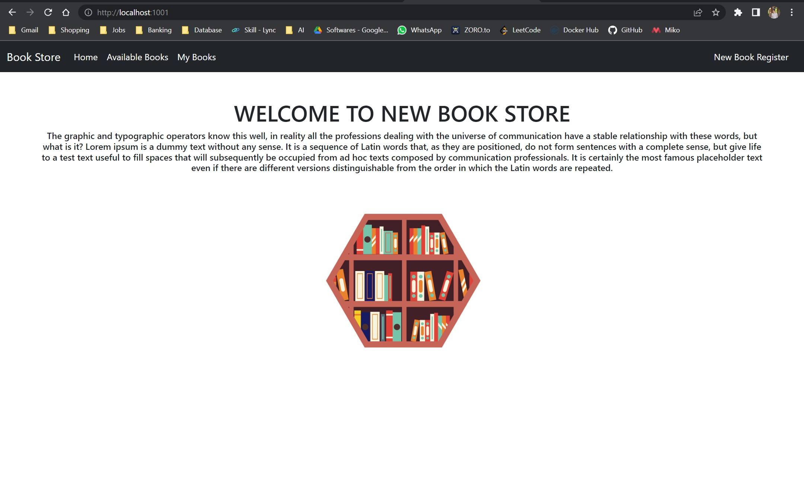

# Book Store Management

# Project Documentation

<p align="center">
  <a href="" rel="noopener">
 </a>
</p>


<h3 align="center">Book Store Management</h3>

---

<p align="center"> Few lines describing your project.
    <br> 
</p>

## 📝 Table of Contents
- [About](#about)
- [Getting Started](#getting_started)
- [Deployment](#deployment)
- [Usage](#usage)
- [Built Using](#built_using)
- [Authors](#authors)
- [Acknowledgments](#acknowledgement)

## 🧐 About <a name = "about"></a>
The Book Store Management project is a portal designed to help users keep track of their personal book collection. With the ability to add any book with its details, users can easily manage their library and keep track of their reading progress. Additionally, the portal allows users to modify book details, delete books, and register new books to their collection. This project aims to simplify book management and provide users with an intuitive and easy-to-use interface. With its various functionalities, the Book Store Management portal is the perfect solution for book enthusiasts who want to stay organized and keep track of their literary adventures.

## 🏁 Getting Started <a name = "getting_started"></a>
These instructions will get you a copy of the project up and running on your local machine for development and testing purposes. See [deployment](#deployment) for notes on how to deploy the project on a live system.

### Prerequisites
You need Eclipse EE edition/STS, Tomcat Server, Spring Framework software to work on this project.
Go to google and search,

```
Download all the required softwares.
```

### Installing
After downloading run the exe file.

The inatallation is simple and easy..

```
After checking all the necessary tools are opted.Click install.
```

After the progress is done to 100
%

```
Click Finish.
```

In my machine I've used Spring tool Suit.

## 🔧 Running the tests <a name = "tests"></a>
Open Spring Tool Suit and Run the project on Spring boot. Check the port on which the server is running.
Open a browser and go to local host and check webpage is running.

## 🎈 Usage <a name="usage"></a>
portal designed to help users keep track of their personal book collection. With the ability to add any book with its details, users can easily manage their library and keep track of their reading progress. Additionally, the portal allows users to modify book details, delete books, and register new books to their collection.

## 🚀 Deployment <a name = "deployment"></a>
Add additional notes about how to deploy this on a live system.

## ⛏️ Built Using <a name = "built_using"></a>
- [Spring Boot](https://spring.io/) - Spring Boot
- [Apache Tomcat](https://tomcat.apache.org/index.html) - Apache Tomcat

## ✍️ Authors <a name = "authors"></a>
- [@akshayandy](https://github.com/akshayandy) - FSD

## 🎉 Acknowledgements <a name = "acknowledgement"></a>
- @imaginary Enginnering
